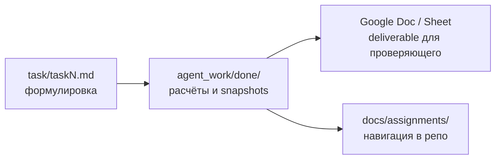

# Карта проекта «От лида до медиаплана»

*Обновлено: 2026-08-20 · DEV_VERSION: `v0.0.5-dev`*

Портфолио работ по контекстной рекламе (Яндекс Директ): B2B-кейс, аудит эффективности e-com, годовой медиаплан. Ниже — дерево ключевых папок и поток от формулировки задания к итоговому deliverable.

## Дерево папок

```
lead-to-plan/
├── README.md                 ← вход для GitHub / проверяющего
├── index.md                  ← эта карта
├── AGENT_CHANGELOG.md        ← версия и журнал изменений
├── task/                     ← исходные формулировки заказчика
│   ├── task1.md              ← Кейс B2B (котельные)
│   ├── task2.md              ← часть 2: эффективность РК
│   └── task3.md              ← часть 3: медиаплан ECCO Kids
├── agent_work/
│   ├── done/                 ← закрытые задачи с артефактами
│   │   ├── 001-direct-test-part2-efficiency/
│   │   │   ├── snapshots/    ← метрики, таблицы сравнения, действия
│   │   │   └── developer/    ← paste, письмо, persona-and-canons
│   │   └── 002-ecco-kids-direct-mediaplan/
│   │       ├── snapshots/    ← листы медиаплана (git-копия)
│   │       └── developer/    ← канон, paste для проверяющего
│   ├── tasks/                ← активные и завершённые TZ-проходы
│   └── inbox/                ← входящие промпты и черновики
├── docs/                     ← документация (INDEX, TAG_INDEX, задания)
└── tests/                    ← pytest: регрессия медиаплана
    └── regression/mediaplan/
```

### `.cursor/` (кратко)

Служебная конфигурация IDE и pipeline агентов — rules, skills, scripts. Для проверки заданий не обязательна; основной контент — в `task/`, `agent_work/done/` и `docs/`.

## Поток работы



| Шаг | Где | Что |
|-----|-----|-----|
| 1 | `task/` | Текст задания от заказчика |
| 2 | `agent_work/done/` | Расчёты, каноны, снимки таблиц, paste для Sheets |
| 3 | Google Docs / Sheets | Итоговый ответ проверяющему (части 1–3) |
| 4 | `docs/` | Связка «задание → ссылка → путь в репо» |

## Три части — быстрые ссылки

| Часть | Задание | Deliverable | Артефакты |
|-------|---------|-------------|-----------|
| Кейс B2B | [`task/task1.md`](task/task1.md) | [Google Doc](https://docs.google.com/document/d/15305Tsn8MqypVOmnAHCASRaxYbydpezJVsMm4jCJf8U/edit?tab=t.0) | текст кейса в `task/` |
| 2 | [`task/task2.md`](task/task2.md) | [Google Sheet](https://docs.google.com/spreadsheets/d/1iZnMulCuyP5-Xo4aeJPjgoArYnPlkGjvdJFw8yIFhKI/edit?gid=0#gid=0) | [`001-direct-test-part2-efficiency/`](agent_work/done/001-direct-test-part2-efficiency/) |
| 3 | [`task/task3.md`](task/task3.md) | [Google Sheet](https://docs.google.com/spreadsheets/d/1avkiFSoxmjjAMnEqFOZ1CMU7gRuVcHpLFhmjhtzD1Ys/edit?gid=92372183#gid=92372183) | [`002-ecco-kids-direct-mediaplan/`](agent_work/done/002-ecco-kids-direct-mediaplan/) |

## Документация

Полный указатель — в **[docs/README.md](docs/README.md)**:

- [INDEX.md](docs/INDEX.md) — по категориям
- [TAG_INDEX.md](docs/TAG_INDEX.md) — по тегам
- Страницы по каждой части — `docs/assignments/`
